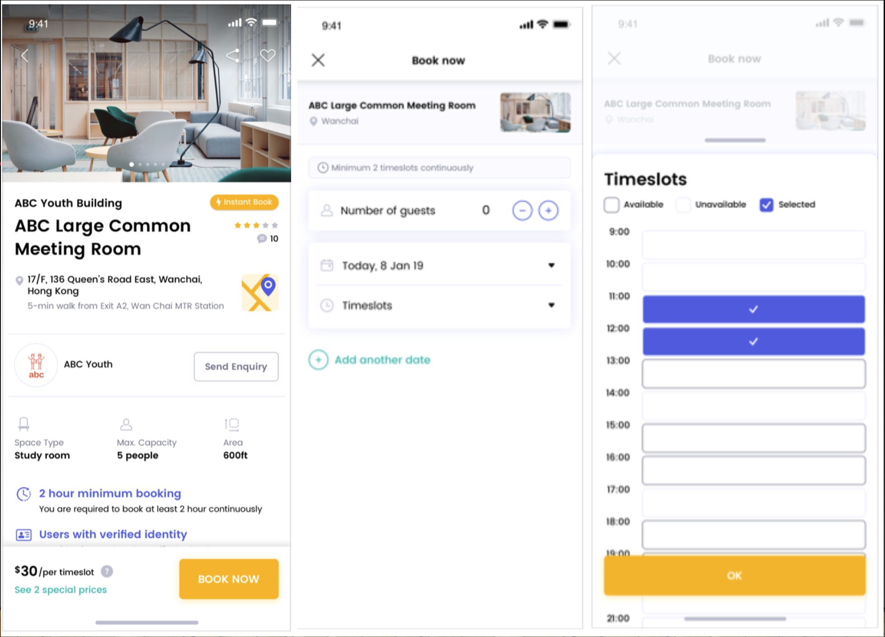

# Reservation System [under development] 

<h2 style="display: inline-block">Table of Contents</h2>

<ol>
  <li><a href="#overview">Overview</a></li>
  <li><a href="#feature">Feature</a></li>
  <li><a href="#requirements">Requirements</a></li>
  <li><a href="#usage">Usage</a></li>
  <li><a href="#tests">Tests</a></li>
  <li><a href="#contact">Contact</a></li>
</ol>

## Overview
場地提供者（業主）將場地資訊放上平台後，客戶有舉辦活動需求，使用租借媒合平台能查看相關場地資訊並尋找合適的場地，搜尋的條件以人數、時段、地區和場地類型作爲篩選條件，選定場地後點選book now的按鈕，會彈跳出視窗提供使用者輸入人數以及日期，時間會以timeslot的方式呈現提供選擇，成立活動（訂單）。  

## Feature
2C:
+ [ ] 使用者註冊登入
+ [ ] 場地查看
+ [ ] 場地預約及取消

2B:
+ [ ] 業主註冊登入
+ [ ] 場地上架

場地可選擇範圍：   
地區： Taipei, Taoyuan   
人數上限： 30, 40, 50, 100   
場地類型： 演講廳 會議室   
時段: 每小時為單位, timeslot, 9~21   

關係：   

用戶 user  

業主 owner  

場地 place   
地區 region   
類型 type   

活動（訂單）activity   

